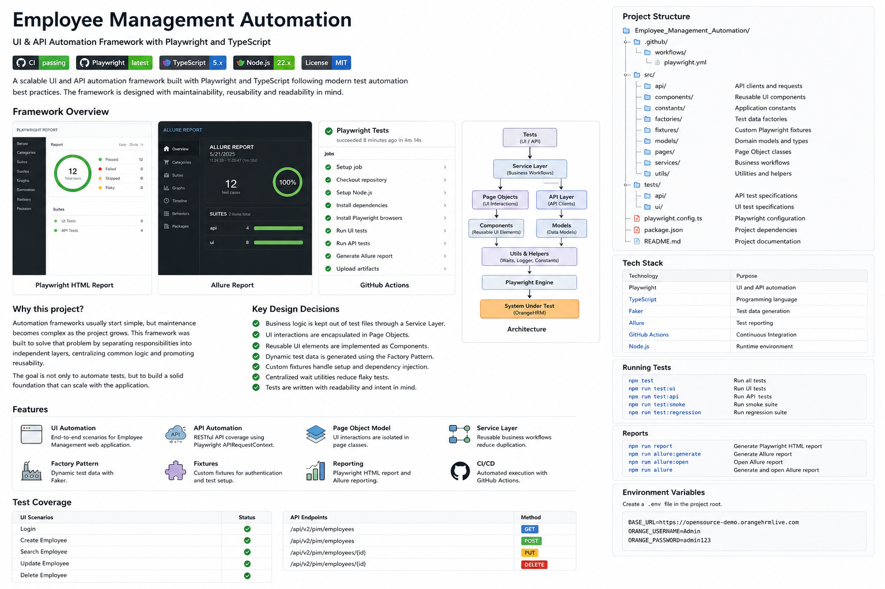
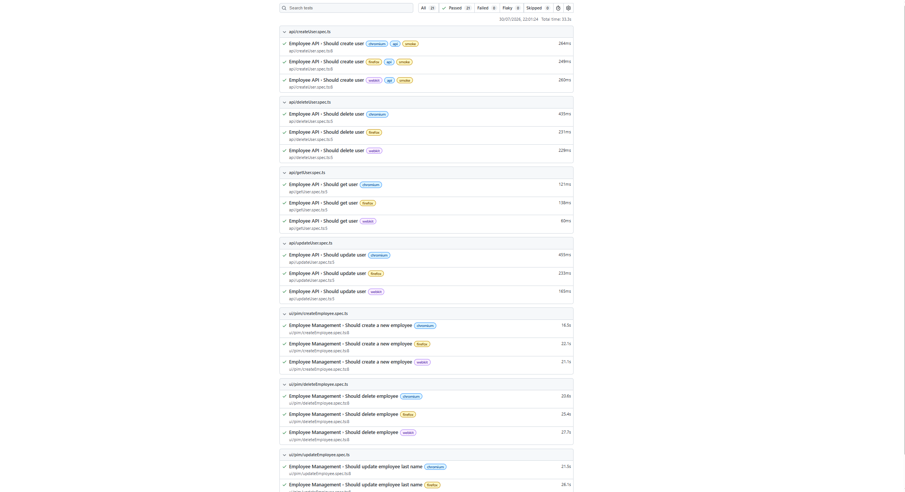
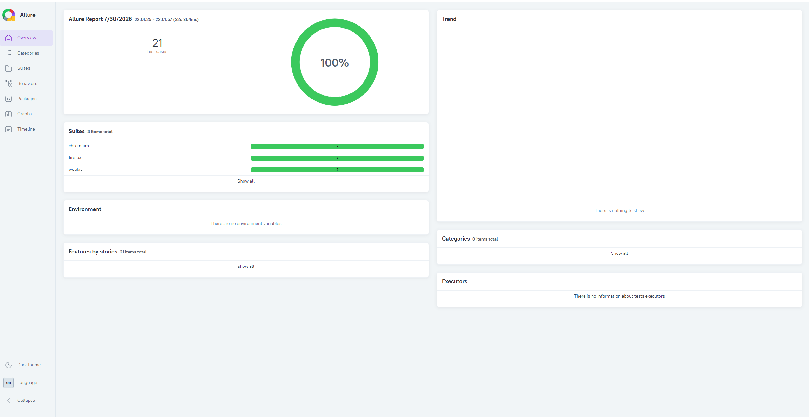
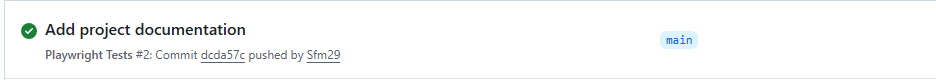

# Employee Management Automation

[](https://github.com/Sfm29/Employee_Management_Automation/actions/workflows/playwright.yml)


A scalable UI and API automation framework built with **Playwright** and **TypeScript**.

The project demonstrates modern automation architecture by combining UI and API testing with reusable components, Page Object Model, Service Layer, centralized utilities and Continuous Integration using GitHub Actions.

---

# Table of Contents

- [Overview](#overview)
- [Framework Overview](#framework-overview)
- [Technology Stack](#technology-stack)
- [Architecture](#architecture)
- [Project Structure](#project-structure)
- [Implemented Features](#implemented-features)
- [Getting Started](#getting-started)
- [Environment Variables](#environment-variables)
- [Running Tests](#running-tests)
- [Reports](#reports)
- [Continuous Integration](#continuous-integration)
- [License](#license)

---

# Overview

This project was created to demonstrate how a maintainable automation framework can be built using Playwright and TypeScript.

Instead of concentrating business logic inside test files, the framework separates responsibilities into dedicated layers, making the code easier to understand, maintain and extend.

The project includes both UI and API automation and follows software engineering practices commonly used in enterprise automation projects.

---

# Framework Overview

## Architecture



## Playwright HTML Report



## Allure Report



## GitHub Actions



---

# Technology Stack

| Technology | Purpose |
|------------|---------|
| TypeScript | Programming Language |
| Playwright | UI & API Automation |
| Faker | Dynamic Test Data |
| Allure | Test Reporting |
| GitHub Actions | Continuous Integration |
| Node.js | Runtime Environment |

---

# Architecture

The framework follows a layered architecture where each layer has a single responsibility.

```
Tests
   │
   ▼
Services
   │
   ▼
Page Objects
   │
   ├────────── Components
   ├────────── API Layer
   ├────────── Factories
   └────────── Utilities
```

### Tests

Business scenarios only.

### Services

Coordinate complete business workflows while keeping tests concise and readable.

### Page Objects

Encapsulate page interactions and isolate UI changes from the test layer.

### API Layer

Centralizes API requests and response validation.

### Factories

Generate dynamic test data using Faker.

### Utilities

Provide reusable helpers such as waits, logging and shared methods.

---

# Project Structure

```text
.
├── .github/
│   └── workflows/
│       └── playwright.yml
│
├── docs/
│   └── images/
│
├── src/
│   ├── api/
│   ├── components/
│   ├── constants/
│   ├── factories/
│   ├── fixtures/
│   ├── models/
│   ├── pages/
│   ├── services/
│   └── utils/
│
├── tests/
│   ├── api/
│   └── ui/
│
├── LICENSE
├── README.md
├── package.json
└── playwright.config.ts
```

---

# Implemented Features

## UI Automation

- Login
- Create Employee
- Search Employee
- Update Employee
- Delete Employee

## API Automation

- GET
- POST
- PUT
- DELETE

## Framework Features

- Page Object Model
- Service Layer
- Factory Pattern
- Custom Fixtures
- Wait Utilities
- Logging
- HTML Reporting
- Allure Reporting
- GitHub Actions

---

# Getting Started

## Clone the repository

```bash
git clone https://github.com/Sfm29/Employee_Management_Automation.git
```

## Install dependencies

```bash
npm install
```

## Install Playwright browsers

```bash
npx playwright install
```

---

# Environment Variables

Create a `.env` file in the project root.

```env
BASE_URL=https://opensource-demo.orangehrmlive.com
ORANGE_USERNAME=Admin
ORANGE_PASSWORD=admin123
```

---

# Running Tests

Run all tests

```bash
npm test
```

Run UI tests

```bash
npm run test:ui
```

Run API tests

```bash
npm run test:api
```

Run smoke tests

```bash
npm run test:smoke
```

Run regression tests

```bash
npm run test:regression
```

---

# Reports

Generate the Allure report

```bash
npm run allure:generate
```

Open the Allure report

```bash
npm run allure:open
```

Generate and open automatically

```bash
npm run allure
```

Generate the Playwright HTML report

```bash
npm run report
```

---

# Continuous Integration

The project uses GitHub Actions to automatically validate every push to the repository.

The pipeline performs the following steps:

- Install project dependencies
- Install Playwright browsers
- Execute UI tests
- Execute API tests
- Generate Allure reports
- Upload build artifacts

---

# License

This project is licensed under the MIT License.

See the [LICENSE](LICENSE) file for details.

---

# Author

**Steve Fernandes**

GitHub: https://github.com/Sfm29