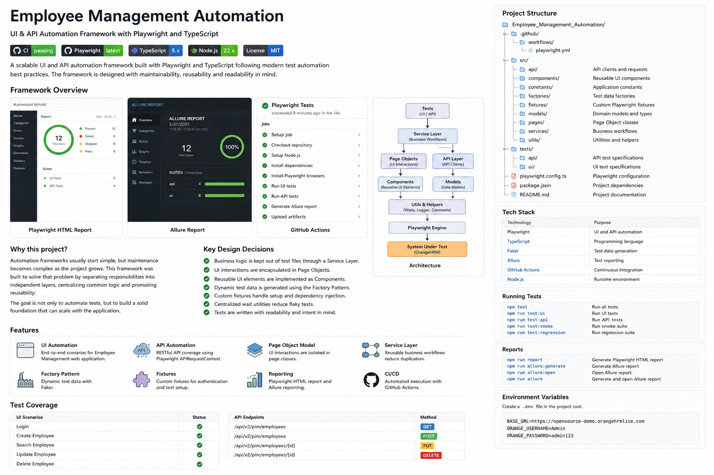
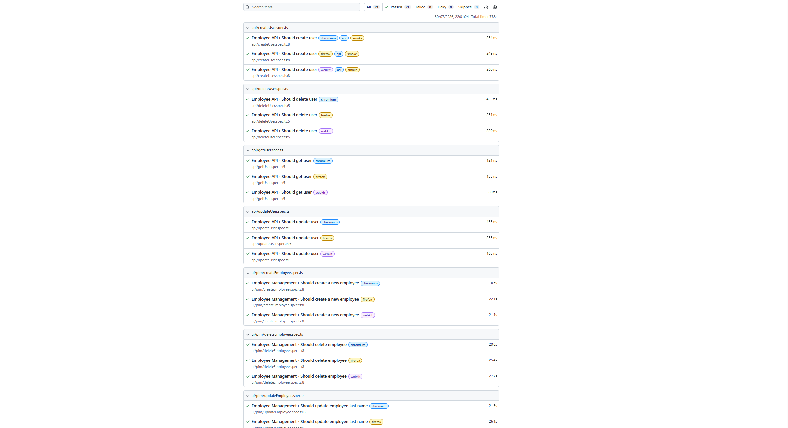
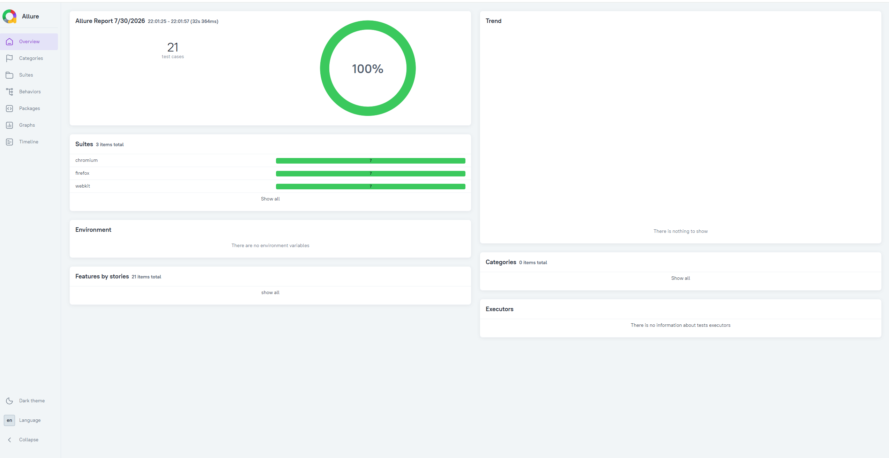

# Employee Management Automation

A professional end-to-end automation framework built with Playwright and TypeScript for UI and API testing.

[](https://github.com/Sfm29/Employee_Management_Automation/actions/workflows/playwright.yml)


The project demonstrates modern test automation practices, including Page Object Model, Service Layer, reusable fixtures, dynamic test data generation, reporting, and continuous integration using GitHub Actions. It is a scalable UI and API automation framework built with **Playwright** and **TypeScript**, combining UI and API testing with reusable components, centralized utilities and Continuous Integration.

---

## Features

- UI automation using Playwright
- API automation using Playwright APIRequestContext
- Page Object Model (POM)
- Service Layer abstraction
- Factory Pattern for dynamic test data
- Reusable Fixtures
- Centralized Wait Utilities
- Logging support
- Allure Reporting
- HTML Reporting
- GitHub Actions CI
- Environment-based configuration
- Smoke and Regression test execution
- AI-powered QA Agent
- AI Agent tool orchestration
- Employee search automation
- Employee creation automation
- Automated result verification

---

## Table of Contents

- [Overview](#overview)
- [Framework Overview](#framework-overview)
- [AI-Powered QA Agent](#ai-powered-qa-agent)
- [Technology Stack](#technology-stack)
- [Architecture](#architecture)
- [Project Structure](#project-structure)
- [Implemented Features](#implemented-features)
- [Getting Started](#getting-started)
- [Environment Variables](#environment-variables)
- [Running Tests](#running-tests)
- [Running the AI Agent](#running-the-ai-agent)
- [Reports](#reports)
- [Continuous Integration](#continuous-integration)
- [Design Principles](#design-principles)
- [Future Improvements](#future-improvements)
- [License](#license)
- [Author](#author)

---

## Overview

This project was created to demonstrate how a maintainable automation framework can be built using Playwright and TypeScript.

Instead of concentrating business logic inside test files, the framework separates responsibilities into dedicated layers, making the code easier to understand, maintain and extend.

The project includes both UI and API automation and follows software engineering practices commonly used in enterprise automation projects.

---

## Framework Overview

### Architecture



### Playwright HTML Report



### Allure Report



### GitHub Actions


---

## AI-Powered QA Agent

The project also includes an AI-powered QA Agent built on top of the existing Playwright and TypeScript automation framework.

The AI Agent acts as an orchestration layer and uses controlled automation tools to interact with the application and verify results.

The Agent reuses the existing Page Objects and Service Layer instead of creating a separate browser automation implementation.

### Current Agent Tools

#### Search Employee

The Agent can search for an employee using the employee ID and verify whether the employee exists.

Example:

```text
Tool: searching for employee 12345

Tool result:
{
  status: 'PASS',
  employeeId: '12345',
  message: 'Employee 12345 was found.'
}

Agent result:
PASS — Employee 12345 was found.
```

#### Create Employee

The Agent can create an employee using the existing automation framework and then verify that the employee was successfully created.

Example:

```text
Tool: creating employee John Agent (999998)

Tool result:
{
  status: 'CREATED',
  employee: {
    firstName: 'John',
    lastName: 'Agent',
    employeeId: '999998'
  },
  message: 'Employee John Agent with ID 999998 was created successfully.'
}

Tool: searching for employee 999998

Tool result:
{
  status: 'PASS',
  employeeId: '999998',
  message: 'Employee 999998 was found.'
}

Agent result:
PASS — Employee John Agent (ID 999998) was created successfully and then verified as existing.
```

### Agent Architecture

```text
AI QA Agent
     │
     ▼
Agent Tools
     │
     ▼
Employee Services
     │
     ▼
Page Objects
     │
     ▼
Playwright
     │
     ▼
Application
```

The current Agent supports employee search and employee creation workflows with result verification.

---

## Technology Stack

| Technology        | Purpose                       |
| ----------------- | ----------------------------- |
| TypeScript        | Programming language          |
| Playwright        | UI and API automation         |
| Faker             | Test data generation          |
| Allure            | Test reporting                |
| GitHub Actions    | Continuous Integration        |
| Node.js           | Runtime environment           |
| OpenAI Agents SDK | AI Agent & Tool Orchestration |
| OpenAI API        | AI Model Integration          |

---

## Architecture

The framework follows a layered architecture where each layer has a single responsibility, designed to improve readability, maintainability and scalability.

```text
Tests
   │
   ▼
Services
   │
   ▼
Page Objects
   │
   ├────────── Components
   ├────────── API Layer
   ├────────── Factories
   └────────── Utilities
```

### Tests

Business scenarios only.

### Services

Coordinate complete business workflows while keeping tests concise and readable. Business operations are grouped into reusable services to reduce duplication and simplify test implementation.

### Page Objects

UI interactions are encapsulated inside dedicated Page Objects, keeping tests focused on business scenarios rather than implementation details. They isolate UI changes from the test layer.

### API Layer

Centralizes API requests and response validation.

### Fixtures

Custom Playwright fixtures centralize common setup logic and dependency injection.

### Factories

Generate dynamic test data using Faker, avoiding hardcoded values and improving test independence.

### Utilities

Shared utilities provide centralized waiting strategies, logging and helper methods used across the framework.

---

## Project Structure

```text
.
├── .github/
│   └── workflows/
│       └── playwright.yml
│
├── docs/
│   └── images/
│
├── src/
│   ├── api/
│   ├── components/
│   ├── constants/
│   ├── factories/
│   ├── fixtures/
│   ├── models/
│   ├── pages/
│   ├── services/
│   └── utils/
│
├── tests/
│   ├── api/
│   └── ui/
│
├── LICENSE
├── README.md
├── package.json
├── playwright.config.ts
└── tsconfig.json
```

---

## Implemented Features

### UI Automation

- Login
- Create Employee
- Search Employee
- Update Employee
- Delete Employee

### API Automation

- GET User
- POST User
- PUT User
- DELETE User

### Framework Features

- Page Object Model
- Service Layer
- Factory Pattern
- Custom Fixtures
- Wait Utilities
- Logging
- HTML Reporting
- Allure Reporting
- GitHub Actions

### AI Agent Features

- AI Agent runtime
- Browser initialization
- Automated login
- Employee search tool
- Employee creation tool
- Tool orchestration
- Employee creation verification
- Employee search verification
- PASS / NOT_FOUND / ERROR results
- Reuse of existing Playwright automation services

---

## Getting Started

### Clone the repository

```bash
git clone https://github.com/Sfm29/Employee_Management_Automation.git
```

### Install dependencies

```bash
npm install
```

### Install Playwright browsers

```bash
npx playwright install
```

---

## Environment Variables

Create a `.env` file in the project root.

```env
BASE_URL=https://opensource-demo.orangehrmlive.com
ORANGE_USERNAME=
ORANGE_PASSWORD=
OPENAI_API_KEY=
```

---

## Running Tests

Run all tests

```bash
npm test
```

Run UI tests

```bash
npm run test:ui
```

Run API tests

```bash
npm run test:api
```

Run smoke tests

```bash
npm run test:smoke
```

Run regression tests

```bash
npm run test:regression
```

---

## Running the AI Agent

Start the AI-powered QA Agent with:

```bash
npm run agent
```

The Agent initializes the browser, authenticates against the application and exposes QA automation tools.

The current Agent supports employee search and employee creation workflows.

Example:

```text
Create employee
       │
       ▼
Employee created
       │
       ▼
Search employee
       │
       ▼
Employee verified
       │
       ▼
PASS
```

The AI Agent reuses the existing Playwright automation framework, Services and Page Objects.

---

## Reports

Generate the Allure report

```bash
npm run allure:generate
```

Open the Allure report

```bash
npm run allure:open
```

Generate and open automatically

```bash
npm run allure
```

Generate the Playwright HTML report

```bash
npm run report
```

---

## Continuous Integration

The project uses GitHub Actions to automatically execute the test suite and validate every push to the repository.

The workflow performs the following tasks:

- Installs project dependencies
- Installs Playwright browsers
- Executes UI and API tests
- Generates Allure reports
- Publishes test artifacts

---

## Design Principles

- Separation of concerns
- Reusable components
- Low coupling
- High maintainability
- Readable test scenarios
- Scalable architecture

---

## Future Improvements

Possible future enhancements include:

- Cross-browser execution matrix
- Parallel execution optimization
- Docker support
- Performance testing
- Visual regression testing
- API contract validation
- Additional AI QA Agent tools
- AI-generated test scenarios
- AI-assisted test planning
- AI-assisted test case generation
- AI-driven test prioritization
- Automated bug report generation

---

## License

This project is licensed under the MIT License.

See the [LICENSE](LICENSE) file for details.

---

## Author

**Steve Ferreira**

GitHub: [github.com/Sfm29](https://github.com/Sfm29)
